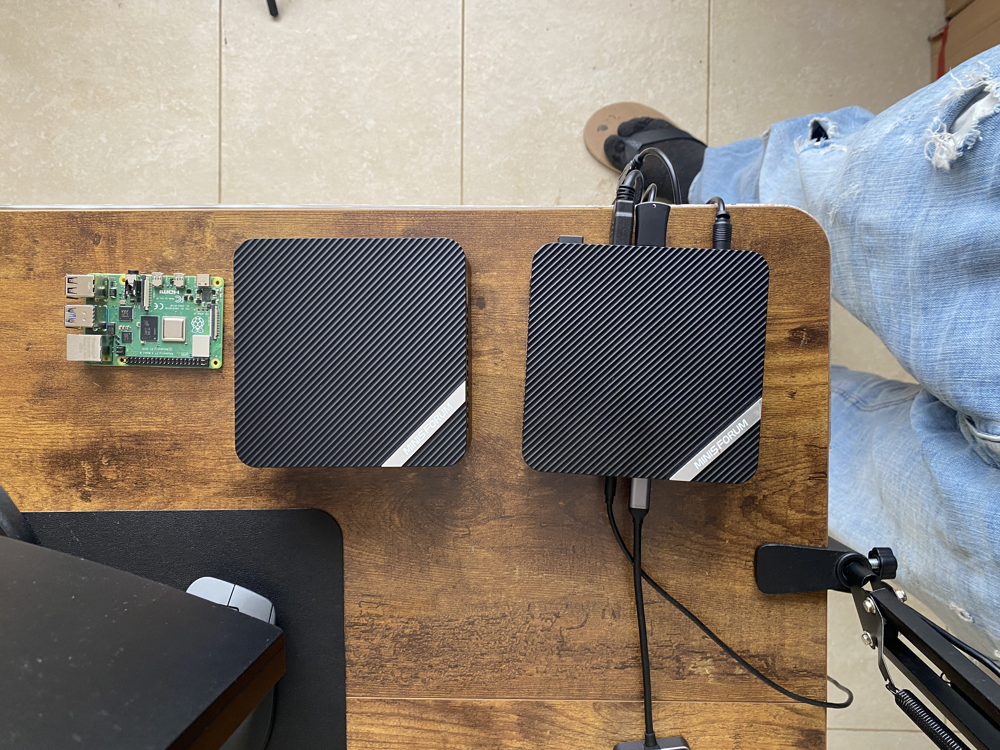
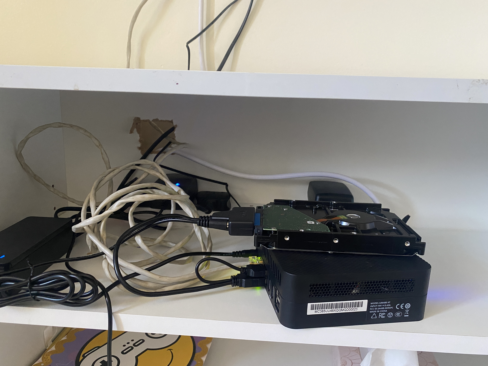
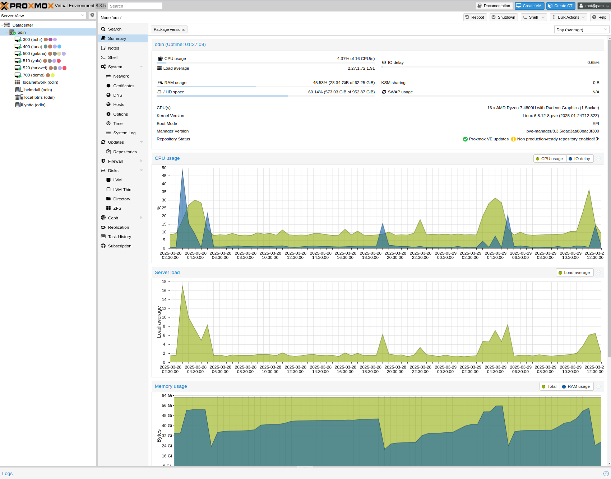
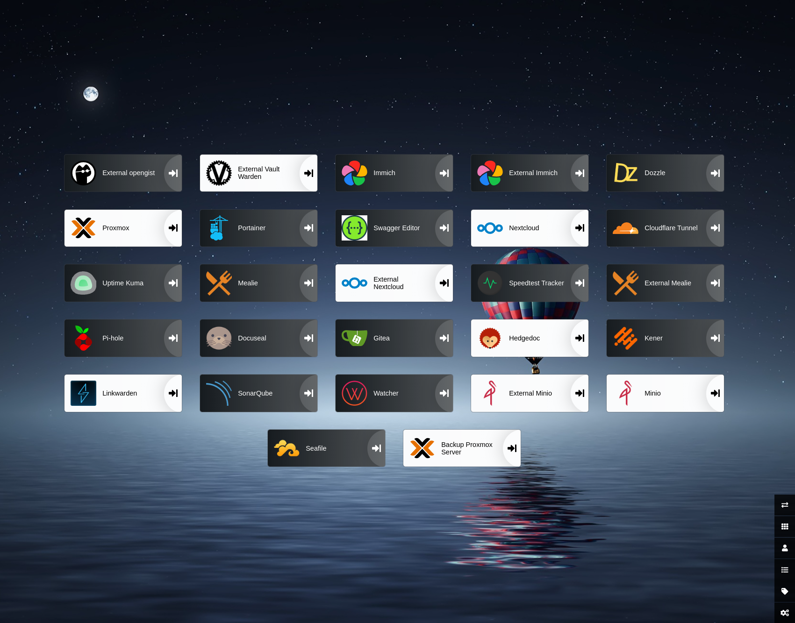
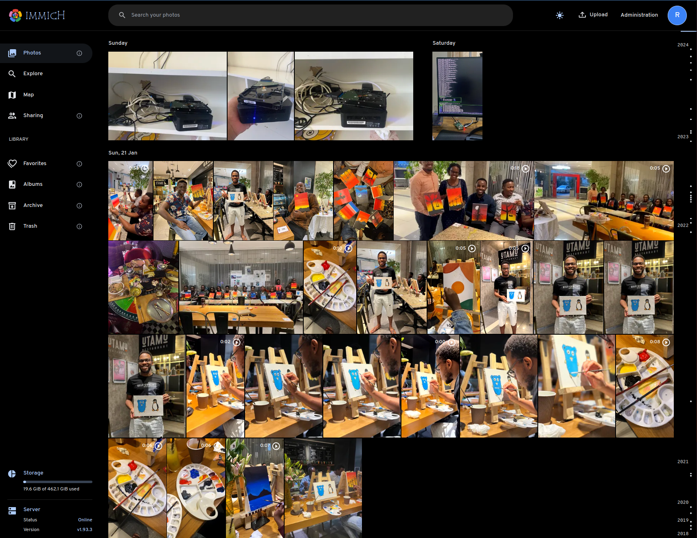

# Rodney Osodo's Homelab

Hello, I'm [Rodney Osodo](https://rodneyosodo.com) [@blackd0t](https://twitter.com/b1ackd0t) on Twitter. I'm a software engineer and homelab enthusiast. I use it to learn new technologies and to host my projects and other services I use. This repository contains the configuration files for my homelab.

## Goals

- [x] Have fun.
- [x] Learn new technologies.
- [ ] De-google my life.
- [ ] To eventually provide a highly available and scalable infrastructure for my projects and services with no single point of failure.

## Hardware

I have a single server running Proxmox VE 8.3.5 with the following specs:

- CPU: AMD Ryzen 7 4800H with Radeon Graphics (16) @ 1.4GHz - 2.9GHz
- RAM: 64 GB DDR4-3200 Memory
- SSD: 1x 1 TB NVMe SSD
- Disk: 1x 2 TB HDD

I also have a backup server running Proxmox Backup Server 3.3.0 with the following specs:

- CPU: Intel N100 (4) @ 2.9GHz
- RAM: 16 GB DDR4-3200 Memory
- SSD: 500GB NVMe SSD
- Disk: 1x 4 TB HDD

I have a 30 Mbps uplink and a 30 Mbps downlink internet connection from Safaricom (planning to upgrade depending on usage). I don't have a static IP address so I use [cloudflare-tunnel](https://www.cloudflare.com/products/tunnel/) and [tailscale](https://tailscale.com/) to expose my services to the internet.

Some photos of my homelab:

More photos can be found in this [Immich-photo-album](https://immich.rodneyosodo.com/share/iOpV-9a7QcQyQWLxO79D8lBEl88jXS5Hq3xl_j_ADaAgCbqW95Q2AoYBXPcXKJgA0GA).

## Software

I use Proxmox VE as my hypervisor and run Debian 12 (Bookworm) on the VMs.

For VM provisioning, I use [Terraform](https://www.terraform.io/) and my scripts can be found [here](./terraform). I use [ansible](https://docs.ansible.com/) to bootstrap the VMs and the scripts can be found [here](./ansible).

## Services

Here are some of the notable services that I use:

### heimdall

Heimdall is a dashboard for all my web applications. It is a way to organize all the applications that I use daily.

### cloudflared

Cloudflared is a lightweight tunnel daemon that proxies any localhost HTTP traffic through the Cloudflare network. I use it to expose my services to the internet.

### immich

Immich is a photo album that I use to store all my photos. I use it to store all my photos. Immich is divided into several services, which are run as individual docker containers.

## Other Resources

- [My blog](https://rodneyosodo.com)
- [Dotfiles](https://github.com/rodneyosodo/dotfiles)
